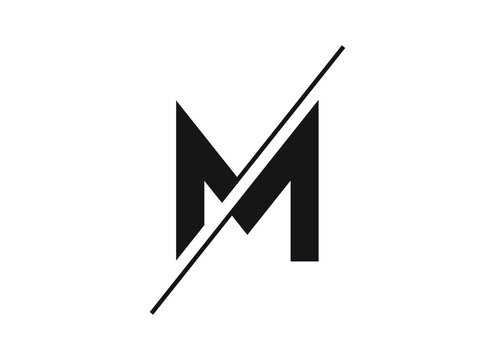

# Portfolio - Matas Štrimaitis

A modern portfolio website showcasing development projects and skills. Built with React, TypeScript, and Vite.

## About

Portfolio displays 6 major projects across different technologies:

- Mobile Development (Kotlin)
- Full-Stack Web Development (React, Node.js, Express)
- Desktop Applications (C#, WinForms)
- Security & Encryption (C#, .NET)

## Projects

1. **Slingo** - Android Song Management App (Kotlin)
   - [View on GitHub](https://github.com/Matorota/Slingo)

2. **CV-Desktop-Version** - Portfolio Showcase (React + TypeScript)
   - [Live Demo](https://cv-dekstop-version.vercel.app/)

3. **GameBlog** - Full-Stack CRUD App (React Native)
   - [View on GitHub](https://github.com/Matorota/full-stack-react-native-gameBlog)

4. **Navaro Web Store** - E-commerce CRUD App (React + Express + MySQL)
   - [View on GitHub](https://github.com/Matorota/CRUD-ClothingStore)

5. **Akademine_sistema** - Academic Management System (C# + SQL Server)
   - [View on GitHub](https://github.com/Matorota/Akademine_sistema)

6. **PasswordManager** - Secure Password Management (C# + .NET)
   - [View on GitHub](https://github.com/Matorota/PasswordManager)

## Tech Stack

- React 19, TypeScript, Vite
- Modern CSS3 with black theme
- Git version control

## Installation

```bash
git clone https://github.com/Matorota/Portfolio.git
cd Portfolio
npm install
npm run dev
```

## Commands

```bash
npm run dev      # Start dev server
npm run build    # Build for production
npm run preview  # Preview production build
npm run lint     # Run ESLint
```

## Contact

GitHub: [@Matorota](https://github.com/Matorota)
